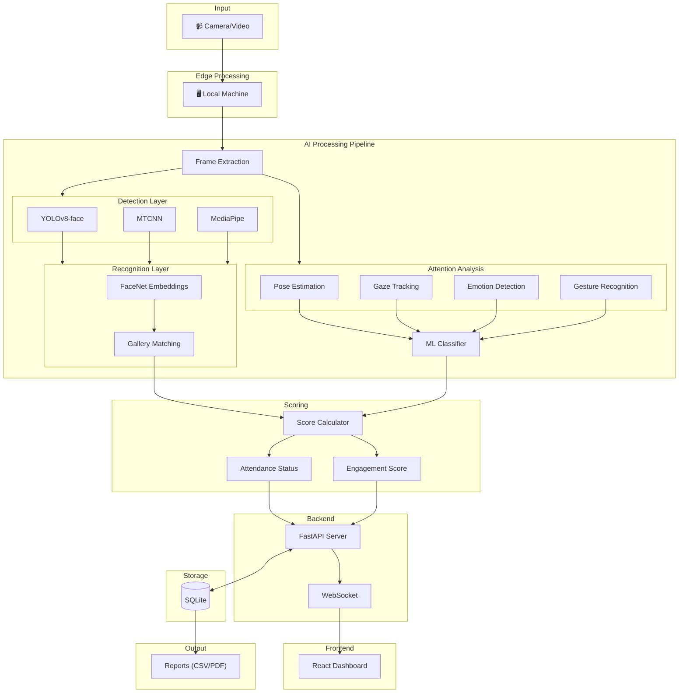

<p align="center">
  
  
  
  
  
</p>

<h1 align="center">🎓 Class Vision — CORIS</h1>

<p align="center">
  <b>Classroom Observation & Recognition Intelligence System</b><br/>
  AI-powered face recognition and student engagement tracking for smart classrooms.
</p>

---

## Overview

Class Vision automates attendance tracking and monitors student attentiveness in real-time using video feeds from classroom cameras. It combines face recognition for identification with behavioral analysis for engagement scoring.

**Core Capabilities:**
- 🎯 Automated face detection and recognition (95%+ accuracy)
- 📊 Real-time attentiveness monitoring (4 states: Attentive, Distracted, Drowsy, Sleeping)
- 📡 Live dashboard with WebSocket updates
- 📋 Comprehensive analytics and CSV/PDF reports
- 💾 Persistent SQLite storage across sessions

---

## Screenshots

<!-- Add screenshots of your dashboard here -->
<!--  -->
<!--  -->

> 📸 *Screenshots coming soon — run the project locally to see the dashboard in action!*

---

## System Architecture



### Data Flow Summary

```
Camera → Edge Device → AI Pipeline → Backend Server → Database
                                          ↓
                            Frontend Dashboard ← WebSocket
                                          ↓
                                   Report Generation
```

---

## Project Structure

```
class-vision/
├── README.md                            # ← You are here
├── LICENSE
├── CONTRIBUTING.md
├── .gitignore
│
└── project/
    ├── backend/
    │   ├── server.py                    # FastAPI + WebSocket server
    │   ├── attendance_pipeline.py       # Face detection & recognition
    │   ├── enhanced_attendance_pipeline.py  # Full pipeline with attentiveness
    │   ├── database.py                  # SQLite persistence layer
    │   ├── prepare_new_students_dataset.py  # Gallery preparation utility
    │   ├── requirements.txt
    │   ├── .env.example                 # Environment variable reference
    │   └── attentiveness/
    │       ├── manager.py               # Coordinates all attention modules
    │       ├── pose_estimator.py        # Head pose (yaw/pitch/roll)
    │       ├── gaze_tracker.py          # Eye gaze direction
    │       ├── emotion_detector.py      # Facial emotion analysis
    │       ├── gesture_detector.py      # Hand gesture recognition
    │       └── classifier.py            # ML attention state classifier
    │
    ├── frontend/
    │   ├── index.html
    │   ├── package.json
    │   ├── vite.config.ts
    │   ├── tailwind.config.js
    │   └── src/
    │       ├── App.tsx                  # Router setup
    │       ├── main.tsx                 # Entry point
    │       ├── index.css                # Global styles
    │       ├── components/
    │       │   └── Layout.tsx           # App shell & navigation
    │       ├── contexts/
    │       │   └── ThemeContext.tsx      # Dark/light mode
    │       ├── hooks/
    │       │   └── useBackend.ts        # API & WebSocket hooks
    │       └── pages/
    │           ├── Dashboard.tsx        # Main analytics view
    │           ├── LiveAnalytics.tsx    # Real-time monitoring
    │           ├── Students.tsx         # Student profiles & data
    │           ├── Sessions.tsx         # Session history
    │           ├── Defaulters.tsx       # Attendance defaulters
    │           └── Help.tsx             # Help & documentation
    │
    ├── Input/                           # Place video files here
    ├── Output/                          # Processed output videos
    ├── SI1/                             # Student photo gallery
    │   └── [StudentName]/
    │       └── photo.jpg
    │
    ├── student_detection_model.ipynb    # Training notebook
    └── DATABASE_README.md               # Database schema docs
```

---

## Technology Stack

### Backend
| Component | Technology | Purpose |
|-----------|------------|---------|
| Web Framework | FastAPI | REST API + WebSocket |
| Face Detection | YOLOv8, MTCNN, MediaPipe | Multi-detector fusion |
| Face Recognition | FaceNet (InceptionResnetV1) | 512-dim embeddings |
| Pose Analysis | MediaPipe + Gradients | Head orientation |
| ML Framework | PyTorch | Deep learning inference |
| Database | SQLite | Session & attendance storage |

### Frontend
| Component | Technology | Purpose |
|-----------|------------|---------|
| Framework | React 18 + TypeScript | UI components |
| Build Tool | Vite | Fast development |
| Styling | Tailwind CSS | Utility-first CSS |
| Charts | Recharts | Data visualization |
| Routing | React Router | SPA navigation |

---

## Quick Start

### Prerequisites

- Python 3.8+
- Node.js 18+
- 8 GB RAM (16 GB recommended)
- GPU with CUDA (optional, improves speed)

### 1. Clone the Repository

```bash
git clone https://github.com/Ramsaheb/class-vision.git
cd class-vision
```

### 2. Backend Setup

```bash
cd project/backend
pip install -r requirements.txt

# (Optional) Copy and configure environment variables
cp .env.example .env
```

### 3. Download Model Weights

Download `yolov8n-face.pt` and place it in `project/`:

```bash
# The model will be auto-downloaded on first run, or you can place it manually
```

### 4. Prepare Student Gallery

Create a folder for each student inside `project/SI1/` with 3–5 photos:

```
project/SI1/
├── Alice/
│   ├── photo1.jpg
│   └── photo2.jpg
├── Bob/
│   └── photo1.jpg
└── ...
```

### 5. Frontend Setup

```bash
cd project/frontend
npm install
```

### 6. Run the System

```bash
# Terminal 1 — Backend
cd project/backend
uvicorn server:app --reload --port 8000

# Terminal 2 — Frontend
cd project/frontend
npm run dev
```

### Access Points

| Service | URL |
|---------|-----|
| Dashboard | http://localhost:5173 |
| API Docs (Swagger) | http://localhost:8000/docs |

---

## API Reference

| Endpoint | Method | Description |
|----------|--------|-------------|
| `/process` | POST | Start video processing |
| `/last-result` | GET | Retrieve latest results |
| `/gallery-info` | GET | Get student gallery stats |
| `/health` | GET | Server health check |
| `/dashboard-data` | GET | Dashboard statistics |
| `/students` | GET | All students with performance |
| `/student/{name}` | GET | Individual student profile |
| `/sessions` | GET | Recent session history |
| `/session/{id}` | GET | Detailed session info |
| `/ws` | WebSocket | Real-time updates stream |

---

## Output Metrics

### CSV Export (30+ fields)

The system exports comprehensive attendance reports including **all students** (present and absent):

| Category | Metrics |
|----------|---------|
| **Identity** | Student Name, Status (Present/Absent), Present (1/0) |
| **Attendance** | Presence Duration (s), Presence %, Recognition Confidence, Detection Sources |
| **Attention** | Attention Score (%), Attentiveness %, Attention State, Peak/Lowest Attention |
| **Engagement** | Engagement Level, Time Attentive/Distracted/Drowsy/Sleeping (s) |
| **Behavioral** | Gaze Score, Gaze Stability, Head Pose (Yaw/Pitch), Head Movement |
| **Emotion** | Dominant Emotion, Emotion Confidence |
| **Participation** | Participation Score, Events, Hand Gestures Detected |
| **Physiological** | Blink Rate, Eye Openness |
| **Session** | Session Name, Session Timestamp |

### Engagement Levels

| Level | Attentiveness % |
|-------|-----------------|
| Highly Engaged | ≥ 80% |
| Well Engaged | 60–79% |
| Moderately Engaged | 40–59% |
| Poorly Engaged | 20–39% |
| Disengaged | < 20% |

---

## Configuration

Key parameters in `project/backend/attendance_pipeline.py`:

```python
# Recognition
MIN_RECOGNITION_SIM = 0.65    # Similarity threshold for match
UNKNOWN_THRESHOLD = 0.55      # Below this = unknown person
STABILITY_FRAMES = 5          # Frames to confirm identity

# Detection
YOLO_CONF = 0.4               # YOLO confidence threshold
MTCNN_THRESHOLD = 0.6         # MTCNN detection threshold
PROCESS_EVERY_N_FRAMES = 1    # Frame processing frequency
```

### Environment Variables

| Variable | Default | Description |
|----------|---------|-------------|
| `AUTO_START_PROCESSING` | `1` | Auto-start video processing on server boot |
| `SMTP_HOST` | — | SMTP server for defaulter email alerts |
| `SMTP_PORT` | — | SMTP port |
| `SMTP_USER` | — | SMTP username |
| `SMTP_PASSWORD` | — | SMTP password |

---

## Troubleshooting

| Issue | Solution |
|-------|----------|
| CUDA out of memory | Set `DEVICE = 'cpu'` or reduce batch size |
| Model not found | Verify `yolov8n-face.pt` is in `project/` |
| WebSocket disconnects | Check backend is running on port 8000 |
| Low recognition accuracy | Add more photos per student (3–5 angles) |
| Slow processing | Enable GPU or increase `PROCESS_EVERY_N_FRAMES` |

---

## Contributing

Contributions are welcome! Please read [CONTRIBUTING.md](CONTRIBUTING.md) for guidelines.

---

## License

This project is licensed under the MIT License — see the [LICENSE](LICENSE) file for details.

---

## Acknowledgements

- [YOLOv8](https://github.com/ultralytics/ultralytics) — Real-time object detection
- [FaceNet-PyTorch](https://github.com/timesler/facenet-pytorch) — Face recognition embeddings
- [MediaPipe](https://github.com/google/mediapipe) — Face mesh and hand tracking
- [FastAPI](https://fastapi.tiangolo.com/) — High-performance Python API framework
- [React](https://react.dev/) + [Vite](https://vitejs.dev/) — Modern frontend tooling

---

<p align="center">
  <i>Built with ❤️ for smarter classrooms</i>
</p>
