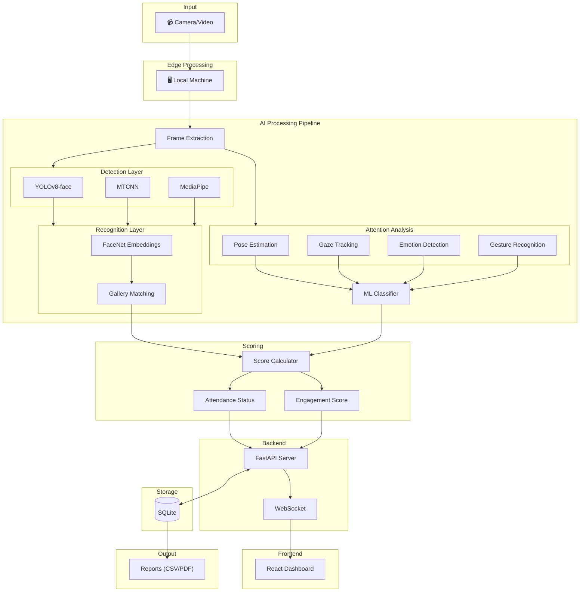

# AI-Powered Face Recognition & Engagement Tracking System

An intelligent classroom attendance and student engagement monitoring system using computer vision and deep learning.

---

## Overview

This system automates attendance tracking and monitors student attentiveness in real-time using video feeds from classroom cameras. It combines face recognition for identification with behavioral analysis for engagement scoring.

**Core Capabilities:**
- Automated face detection and recognition (99%+ accuracy)
- Real-time attentiveness monitoring (4 states: Attentive, Distracted, Drowsy, Sleeping)
- Live dashboard with WebSocket updates
- Comprehensive analytics and CSV/PDF reports

---

## System Architecture



### Data Flow Summary

```
Camera → Edge Device → AI Pipeline → Backend Server → Database
                                          ↓
                            Frontend Dashboard ← WebSocket
                                          ↓
                                   Report Generation
```

---

## Project Structure

```
project/
├── backend/
│   ├── server.py                    # FastAPI + WebSocket server
│   ├── attendance_pipeline.py       # Face detection & recognition
│   ├── enhanced_attendance_pipeline.py  # Full pipeline with attentiveness
│   ├── database.py                  # SQLite persistence layer
│   ├── requirements.txt
│   └── attentiveness/
│       ├── manager.py               # Coordinates all attention modules
│       ├── pose_estimator.py        # Head pose (yaw/pitch/roll)
│       ├── gaze_tracker.py          # Eye gaze direction
│       ├── emotion_detector.py      # Facial emotion analysis
│       ├── gesture_detector.py      # Hand gesture recognition
│       └── classifier.py            # ML attention state classifier
│
├── frontend/
│   └── src/
│       ├── App.tsx                  # Router setup
│       ├── pages/
│       │   ├── Dashboard.tsx        # Main analytics view
│       │   ├── LiveAnalytics.tsx    # Real-time monitoring
│       │   ├── SessionReport.tsx    # Historical reports
│       │   ├── StudentProfile.tsx   # Individual student data
│       │   └── Settings.tsx         # Configuration
│       └── hooks/
│           └── useBackend.ts        # API & WebSocket hooks
│
├── SI1/                             # Student photo gallery
│   └── [StudentName]/
│       └── photo.jpg
│
└── yolov8n-face.pt                  # YOLO face detection model
```

---

## Technology Stack

### Backend
| Component | Technology | Purpose |
|-----------|------------|---------|
| Web Framework | FastAPI | REST API + WebSocket |
| Face Detection | YOLOv8, MTCNN, MediaPipe | Multi-detector fusion |
| Face Recognition | FaceNet (InceptionResnetV1) | 512-dim embeddings |
| Pose Analysis | MediaPipe + Gradients | Head orientation |
| ML Framework | PyTorch | Deep learning inference |
| Database | SQLite | Session & attendance storage |

### Frontend
| Component | Technology | Purpose |
|-----------|------------|---------|
| Framework | React 18 + TypeScript | UI components |
| Build Tool | Vite | Fast development |
| Styling | Tailwind CSS | Utility-first CSS |
| Charts | Recharts | Data visualization |
| Routing | React Router | SPA navigation |

---

## Quick Start

### Prerequisites
- Python 3.8+
- Node.js 18+
- 8GB RAM (16GB recommended)
- GPU with CUDA (optional, improves speed)

### Installation

```bash
# 1. Backend setup
cd backend
pip install -r requirements.txt

# 2. Frontend setup
cd ../frontend
npm install
```

### Required Files
Place these in the project root:
- `yolov8n-face.pt` - YOLO face model weights
- `input.mp4` - Video to process
- `SI1/` - Student gallery (one folder per student with photos)

### Running the System

```bash
# Terminal 1: Backend
cd backend
uvicorn server:app --reload --port 8000

# Terminal 2: Frontend
cd frontend
npm run dev
```

### Access Points
| Service | URL |
|---------|-----|
| Dashboard | http://localhost:5173 |
| API Docs | http://localhost:8000/docs |

---

## API Reference

| Endpoint | Method | Description |
|----------|--------|-------------|
| `/process` | POST | Start video processing |
| `/last-result` | GET | Retrieve latest results |
| `/gallery-info` | GET | Get student gallery stats |
| `/health` | GET | Server health check |
| `/ws` | WebSocket | Real-time updates stream |

---

## Output Metrics

### CSV Export (30+ metrics)

The system exports comprehensive attendance reports including **ALL students** (present and absent) with the following fields:

| Category | Metrics |
|----------|---------|
| **Identity** | Student Name, Status (Present/Absent), Present (1/0) |
| **Attendance** | Presence Duration (s), Presence %, Recognition Confidence, Detection Sources, Number of Tracks |
| **Attention** | Attention Score (%), Attentiveness %, Attention State, Peak/Lowest Attention |
| **Engagement** | Engagement Level, Time Attentive/Distracted/Drowsy/Sleeping (s) |
| **Behavioral** | Gaze Score, Gaze Stability, Head Pose (Yaw/Pitch), Head Movement |
| **Emotion** | Dominant Emotion, Emotion Confidence |
| **Participation** | Participation Score, Participation Events, Hand Gestures Detected |
| **Physiological** | Blink Rate, Eye Openness |
| **Session** | Session Name, Session Timestamp |

### Sample CSV Output
```csv
Student Name,Status,Present (1/0),Presence Time (seconds),Attention Score (%),Engagement Level,...
Ramsaheb,Present,1,45.20,85.50,Highly Engaged,...
Harsh,Present,1,32.10,72.30,Well Engaged,...
Vishal,Absent,0,0.00,0.00,N/A,...
```

### Engagement Levels
| Level | Attentiveness % |
|-------|-----------------|
| Highly Engaged | ≥ 80% |
| Well Engaged | 60-79% |
| Moderately Engaged | 40-59% |
| Poorly Engaged | 20-39% |
| Disengaged | < 20% |

---

## Configuration

Key parameters in `attendance_pipeline.py`:

```python
# Recognition
MIN_RECOGNITION_SIM = 0.65    # Similarity threshold for match
UNKNOWN_THRESHOLD = 0.55      # Below this = unknown person
STABILITY_FRAMES = 5          # Frames to confirm identity

# Detection
YOLO_CONF = 0.4               # YOLO confidence threshold
MTCNN_THRESHOLD = 0.6         # MTCNN detection threshold
PROCESS_EVERY_N_FRAMES = 1    # Frame processing frequency
```

---

## Troubleshooting

| Issue | Solution |
|-------|----------|
| CUDA out of memory | Set `DEVICE = 'cpu'` or reduce batch size |
| Model not found | Verify `yolov8n-face.pt` path |
| WebSocket disconnects | Check backend is running on port 8000 |
| Low recognition accuracy | Add more photos per student (3-5 angles) |
| Slow processing | Enable GPU or increase `PROCESS_EVERY_N_FRAMES` |

---

## License

MIT License

---

*Automated classroom attendance and engagement monitoring system*